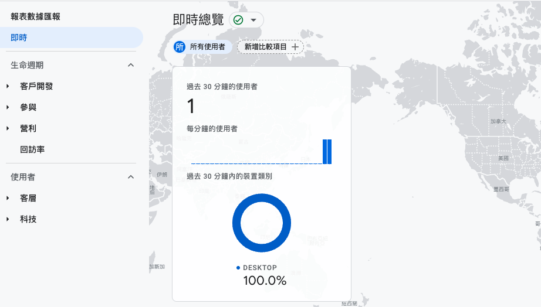

在原本v1站台裏是使用gtm作為ga的資料來源，

觸發後還需要在gtm的內設定轉為事件最後才能再ga呈現，

這樣過程繁瑣到炸，所以目前改用gtag記錄一下過程。

<!--truncate-->

現在專案為vue 3，在vue 2的時候可以使用`vue-gtag`，

vue 3則是使用`vue-gtag-next`

```
yarn add vue-gtag-next
```

在目錄的main中引入vue gtag並加入自己的ga id，

就可以在ga的即時中查看到中看到自己的裝置、動作與數量，



```javascript
import VueGtag from 'vue-gtag-next'
...


createApp()
  .use(VueGtag, {
    property: {
      id: 'G-XXXXXX',
    }
  })
  ...
```
~~這樣差不多完成了(?)~~

現在可以在站台頁面切換到處點點，

透過即時報表來確認資料是否已開始傳入，

即時內只會顯示過去的30分鍾內的的資料，

另外vue-gtag也與g-tag一樣可以送出動作(event)之類等等的事件。

```javascript
import { event } from 'vue-gtag-next'

export default {
  setup () {
    const action = () => {
      event('mine-action', { value: 'menu' })
    }

    return {
      action,
    }
  }
}
```

參考gtag文件
- [gtag.js official documentation](https://developers.google.com/analytics/devguides/collection/gtagjs)
- [vue-gtag-next](https://github.com/MatteoGabriele/vue-gtag-next)
- [vue-gtag-next documentation](https://matteo-gabriele.gitbook.io/vue-gtag/v/next/)
- [在 Vue 3.0 使用 Google Analytics 分析](https://blog.epoch.tw/2021/04/25/%E5%9C%A8-Vue-3-0-%E4%BD%BF%E7%94%A8-Google-Analytics-%E5%88%86%E6%9E%90/)