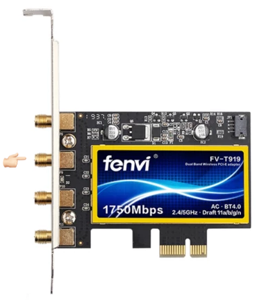
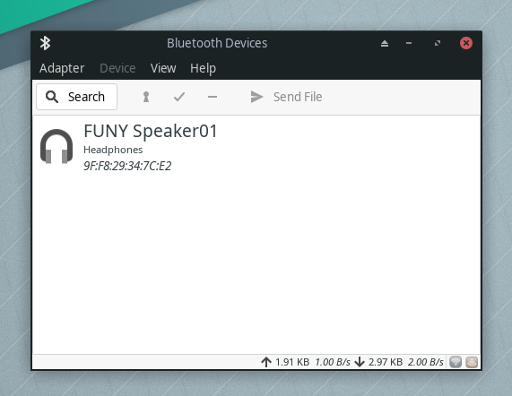
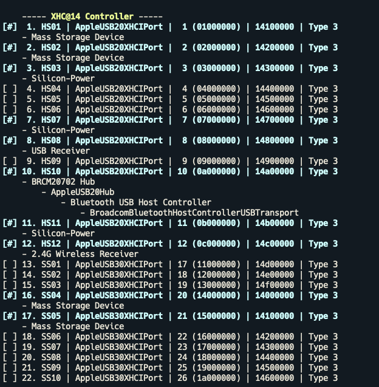

悲劇說在前，隔天測試了一下 airpods 發現會連線失敗，原因是晶片先天的體質 😑，之前買了 nuphy air75 才決心入手在黑蘋果免驅藍牙，一開使蠻推的(看下面的文章有多愉悅)，只能說購買前沒好好功課有夠悲劇的。

<!--truncate-->

最簡單解決的方式直接使用 usb 藍牙就可解決連不上跟太弱的問題，關閉 fenvi FV-T919 的藍牙則是拔除原本安裝在主機板上 usb 供電，天線移除靠近 logo 的那根即可。

**(( 以下就當作紀錄，之後購入新硬體的時候要踩個煞車好好想想啊啊 ))**

市面上除了原廠拆機的藍牙外，最最常見的就是 fenvi FV-T919 相關的系列，也可以順便把無線網路一次到位摸蛤蜊兼洗褲，另外有可以更換網卡但散熱性比較沒這麼好(?)，但想說既然沒有打算換其他的就選好點的四天線版本反正沒差多少，到貨後無線網路測試的完全沒問題而且裝好後還自動連上這有點嚇到(猜是鑰匙圈同步了手機的密碼，方便到太驚訝了 😂)

接著重頭戲的藍牙，可裝完後在系統偏好設定內沒有顯示，想到既然都可以在 macos 免驅，不用補 kext 了，姑且 linux 下試試，果然在 manjaro 下可以取得而且使用也正常反而忘記試試無線網路 😵，好的這樣就排除卡片壞掉的問題了。

爬文後有兩個方向，一是重新編輯 usb 的數量，另外一個則是補上 BrcmPatchRAM 相關的無線網卡 kext，試過一輪後發現正解是重新製作 usb 配置即可。

這裏之前是用 hackintool 弄但過程需要刪刪剪剪蠻麻煩的，論壇找找推薦，後來換成 USBMap 操作上就輕鬆許多，插拔過所有的插槽即可輸出使用，另外需要注意 10.14.1 後解限制補丁的補丁或更新已經沒有用了，所以接口數量上限為 15 個無法一次擁有所有的插槽，雖然我沒有這麼多 usb 的插槽就是，調整完後重開機就是享受了無線帶來的~~便利~~生活了 \\(^o^)/

參考文件

- [黑蘋果啟用 Handoff 功能（Yosemite 10.10）](https://benjenq.pixnet.net/blog/post/41443669)
- [[開箱] "黑蘋果網卡"之Fenvi FV-T919簡單開箱](https://www.ptt.cc/bbs/PC_Shopping/M.1615704188.A.A36.html)
- [USB Mapping | OpenCore Post-Install](https://dortania.github.io/OpenCore-Post-Install/usb/intel-mapping/intel.html)
- [AirPods + Fenvi T919 : hackintosh](https://www.reddit.com/r/hackintosh/comments/ke0nzx/airpods_fenvi_t919/gg33kg1/)
